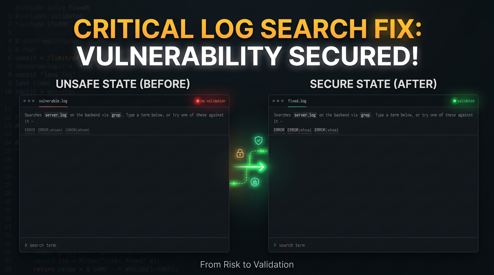
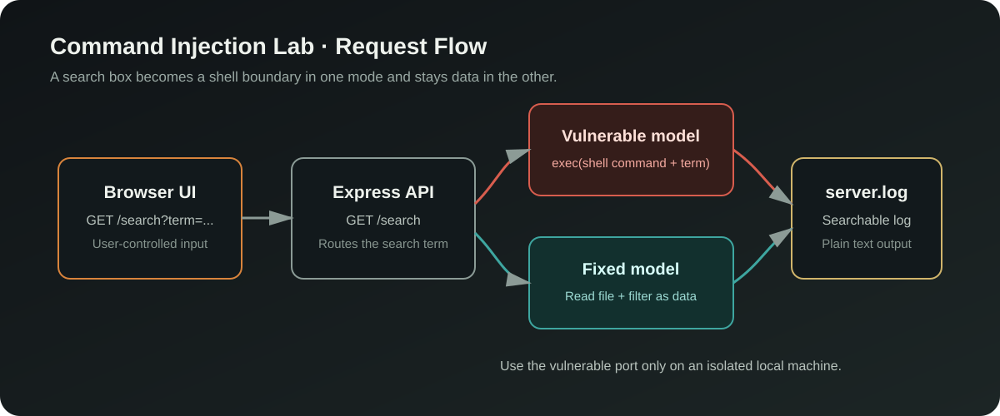
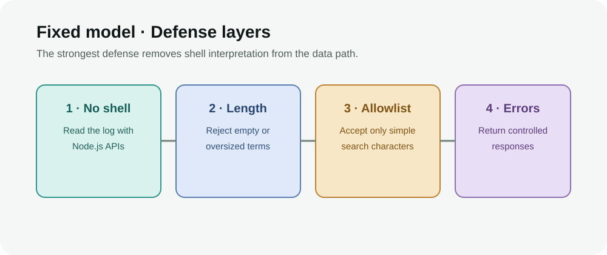

# Command Injection Security Lab

<p align="center">
  
</p>



An intentionally vulnerable Node.js and Express lab that demonstrates how a search parameter can cross the boundary from data into shell syntax. The repository includes a vulnerable implementation that passes user input to `exec` and a fixed implementation that reads the log file directly.

> **Safety:** Run this project only on an isolated local machine. Never expose the vulnerable server to a network or send it sensitive data.

## What You Will Learn

- How shell metacharacters change the meaning of a command.
- Why string interpolation followed by `exec` is dangerous with user input.
- Why removing the shell boundary is stronger than trying to blacklist every payload.
- How input length, character validation, and controlled errors add defense in depth.



## Quick Start

Requirements: Node.js 18 or newer and npm.

```bash
npm install
```

Start the intentionally vulnerable server on port `3000`:

```bash
npm run vulnerable
```

Start the fixed server on port `3001` in a separate terminal:

```bash
npm run fixed
```

Open either URL in a browser:

- Vulnerable mode: <http://localhost:3000>
- Fixed mode: <http://localhost:3001>

The two servers use the same browser interface, so the difference is in the backend model rather than the user workflow.

## Safe Local Demonstration

Start with a normal search term:

```text
ERROR
```

The vulnerable lab also includes buttons for shell-metacharacter examples such as `ERROR;whoami` and `ERROR|whoami`. Use these examples only against the local lab server. In vulnerable mode, the term is interpolated into a shell command; in fixed mode, the request is rejected before any shell can interpret it.

You can also call the endpoint directly:

```bash
curl "http://localhost:3001/search?term=ERROR"
```

## Compare the Two Modes

| Behavior | Vulnerable mode | Fixed mode |
| --- | --- | --- |
| Search implementation | `child_process.exec` with a shell command | `fs.readFileSync` plus JavaScript filtering |
| User input | Interpolated into `grep` | Kept as a search string |
| Shell metacharacters | Can be interpreted | Rejected |
| Length limit | None in the model | 100 characters |
| Output | Shell stdout and execution errors | Controlled text responses |
| Main lesson | Data reaches a command interpreter | Data stays data |

## API Surface

| Method | Route | Purpose |
| --- | --- | --- |
| `GET` | `/mode` | Returns `vulnerable` or `fixed` |
| `GET` | `/search?term=ERROR` | Searches `server.log` for a term |

Missing terms return HTTP `400`. The fixed server returns HTTP `403` for blocked terms and HTTP `500` for an internal log-read failure.

## Where the Vulnerability Lives

The vulnerable model constructs a command equivalent to:

```js
const command = `cat "${logFile}" | grep -i ${term}`;
exec(command, { shell: 'bash.exe' }, callback);
```

Because `term` is inserted into a shell command without safe argument handling, shell operators can introduce additional command behavior. The fixed model does not invoke a shell: it reads the log as text, validates the term, and filters lines in JavaScript.

The fixed model's blacklist is useful for demonstrating a rejected-input response, but blacklists alone are not a complete production defense. Prefer APIs that accept argument arrays without shell interpretation, strict allowlists designed for the business requirement, least-privilege execution, and authenticated access.

## Project Structure

```text
.
├── app.js                         # Shared Express application factory
├── server-vulnerable.js           # Lab server on port 3000
├── server-fixed.js                # Hardened server on port 3001
├── controllers/
│   ├── mode-controller.js         # Reports the active mode
│   └── search-controller.js       # HTTP search behavior
├── models/
│   ├── vulnerable-log-search.js   # Builds and executes a shell command
│   └── fixed-log-search.js        # Reads and filters the log safely
├── routes/search-routes.js        # `/mode` and `/search`
├── public/index.html              # Browser test interface
├── server.log                     # Sample searchable log data
└── docs/images/                   # README diagrams
```

## Suggested Exercises

- Search for `ERROR` in both modes and compare the response formatting.
- Use the provided metacharacter examples against localhost and observe the difference.
- Trace the request from `routes/search-routes.js` into each model.
- Replace the fixed model's blacklist with a requirement-specific allowlist.
- Add authentication, rate limiting, and structured audit logging before exposing a safe version.

## Limitations

This is a deliberately small teaching project, not a production search service. The vulnerable mode is unsafe by design. The fixed mode demonstrates a safer architecture but does not provide authentication, rate limiting, sandboxing, or a complete security policy for every possible search requirement.

## License

Use this lab for learning, testing, and secure-development demonstrations in environments you control.
